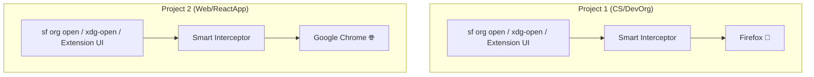

# 🌐 Project Browser Manager

An interactive, project-isolated browser configuration tool for **Antigravity** and **VS Code**.

Assign any installed web browser (e.g. Firefox for *Project 1*, Google Chrome for *Project 2*, Microsoft Edge for *Project 3*, Helium for *Project 4*) to a specific workspace **without changing your OS-level default browser**.

---

## 🎯 The Problem & Solution

### The Problem
By default, operating systems use a single global default browser for opening links. When working on multiple projects simultaneously (e.g. testing one web application in Firefox and another in Chrome, or managing separate Salesforce orgs in different browser profiles), opening links, running CLI commands, or clicking IDE extension buttons forces every project to use the same OS default browser.

### The Solution
`ProjectBrowserManager` creates per-workspace link interceptors and updates local `.vscode/settings.json` configuration. When you have multiple instances of Antigravity or VS Code open side-by-side, each workspace launches links, extension commands, and terminal CLI tools in its own designated browser independently.



---

## ✨ Features

- **🌐 Isolated Per-Project Wrappers**: Uses dedicated wrapper directories (`~/.local/share/antigravity-wrappers/<browser_slug>`). Multiple open projects run in separate Antigravity instances without overwriting each other's settings.
- **🖥️ System XDG URL Interceptor**: Registers a desktop URL handler (`antigravity-browser-opener.desktop` -> `antigravity-smart-open`) to handle `http`/`https` scheme calls issued by Electron/VS Code's `vscode.env.openExternal()` API.
- **📌 Active Workspace Tracking**: Records the active workspace directory into `~/.config/antigravity-project-browser/active-workspace.json` and performs parent directory traversal (`.vscode/settings.json`) to resolve browser settings regardless of subshell working directory.
- **⚡ Complete Salesforce DX & Extension Integration**: Intercepts:
  - Salesforce CLI (`sf org open`, `sf org login`, `sf force:auth:web:login`, `sf auth:web:login`, `sf force:org:open`, `sf force:source:open`)
  - Salesforce Extension UI buttons (**"SFDX: Authorize an Org"**, **"SFDX: Open Default Org"**)
  - Standard system link commands (`xdg-open`, `gio open`, `kde-open`, `kde-open5`, `sensible-browser`, `x-www-browser`)
  - IDE terminal/editor link clicks (`workbench.externalBrowser`)
  - Extension default browser (`openInBrowser.default`, `salesforcedx-vscode-core.preferredBrowser`)
- **🔍 PC Desktop Auto-Discovery**: Automatically scans installed browsers via system `$PATH` and `.desktop` application files.
- **🚀 Subshell Sourcing Support**: Run with `source` or `.vscode/env.sh` to update your active terminal session instantly without restarting the terminal.
- **🧪 Diagnostic Flags**: Status inspection (`--status`), test link launching (`--test`), and workspace reset (`--reset`).

---

## 🛠️ Supported Browsers Out-of-the-Box

The script auto-detects and supports 20+ Linux web browsers including:

| Family | Supported Browsers |
| :--- | :--- |
| **Firefox** | Firefox, Firefox Developer Edition, Firefox Nightly, LibreWolf, Waterfox, Zen Browser |
| **Chrome / Chromium** | Google Chrome (Stable/Beta/Dev), Chromium, Helium Browser, Thorium |
| **Brave** | Brave Browser, Brave Origin, Brave Beta/Nightly |
| **Microsoft Edge** | Microsoft Edge, Microsoft Edge Dev |
| **Others** | Vivaldi, Opera, Tor Browser, Falkon, Epiphany (GNOME Web), Midori, Qutebrowser, custom Flatpaks |

---

## 🚀 Quick Start & Usage

### 1. Global Installation (Recommended)
To run `setup-project-browser` from **any directory** without copying the script everywhere:

```bash
mkdir -p ~/.local/bin
ln -sf /home/mpi/Documents/GitHub/useful_scripts/ProjectBrowserManager/setup-project-browser.sh ~/.local/bin/setup-project-browser
```

### 2. Configure a Workspace

Open any project folder in Antigravity / VS Code terminal and run:

```bash
# Interactive selection menu (auto-scans system installed browsers)
setup-project-browser

# Direct browser selection (quick shortcuts):
setup-project-browser firefox
setup-project-browser chrome
setup-project-browser brave
setup-project-browser edge
setup-project-browser helium
setup-project-browser vivaldi
```

---

## 💡 How to Activate in Your Terminal

When you run the script, it updates your project's `.vscode/settings.json`.

1. **In NEW Terminal Tabs / IDE Extensions**:
   Simply open a new terminal tab in Antigravity / VS Code. Any CLI command (`xdg-open`, `sf org open`, etc.) or Ctrl+Click link in the editor will open in your chosen browser.
2. **In Your CURRENT Active Terminal Tab**:
   Linux subshells cannot alter an existing terminal session's environment variables retroactively. To activate immediately in your active terminal tab, run:
   ```bash
   source .vscode/env.sh
   ```
   *(Or execute the script with `source`: `source setup-project-browser firefox`)*.

---

## ⚙️ Options & Commands Reference

| Command / Option | Description |
| :--- | :--- |
| `setup-project-browser` | Launches interactive browser selection menu scanning your system. |
| `setup-project-browser [name]` | Directly sets the workspace to `[name]` (e.g. `firefox`, `chrome`, `edge`). |
| `setup-project-browser --status` (`-s`) | Displays current workspace settings and checks if the wrapper is active in your terminal shell. |
| `setup-project-browser --test` (`-t`) | Launches a test URL (`https://example.com`) in the configured browser. |
| `setup-project-browser --reset` (`-r`) | Removes project browser overrides from `.vscode/settings.json`. |
| `setup-project-browser --help` (`-h`) | Displays command usage and examples. |

---

## 📁 What Gets Created / Modified

Inside your project root (`./.vscode/`):
1. **`.vscode/settings.json`**:
   - `terminal.integrated.env.linux.PATH`: Prepends `~/.local/share/antigravity-wrappers/<browser_slug>`
   - `terminal.integrated.env.linux.BROWSER`: Target browser binary
   - `workbench.externalBrowser`: Configures IDE link click behavior
   - `salesforcedx-vscode-core.preferredBrowser`: Configures Salesforce DX extension
   - `openInBrowser.default`: Configures Open-in-Browser extension
2. **`.vscode/tasks.json`**:
   - Adds an `"Open URL in <Browser>"` shell task for quick execution via `Ctrl+Shift+P` -> `Run Task`.
3. **`.vscode/env.sh`**:
   - Helper script to quickly source environment variables (`PATH` and `BROWSER`) into active terminal sessions.
4. **`~/.local/share/applications/antigravity-browser-opener.desktop`**:
   - Registered desktop URL handler for `http`/`https` scheme calls from Electron apps.
5. **`~/.config/antigravity-project-browser/active-workspace.json`**:
   - Active workspace tracker for fallback URL routing.
6. **`~/.local/share/antigravity-wrappers/<browser_slug>/`**:
   - Contains wrapper executables (`sf`, `xdg-open`, `gio`, `kde-open`, `kde-open5`, `sensible-browser`, `x-www-browser`).
7. **`~/.gemini/antigravity-ide/bin/` & `~/.local/bin/`**:
   - Global smart interceptors ensuring Extension Host processes delegate to workspace settings.

---

## 🧪 Testing Your Setup

After running the script, test link launching by clicking the printable link output:
```
👉 https://example.com
```
Or test via terminal command:
```bash
source .vscode/env.sh
xdg-open https://example.com
```
